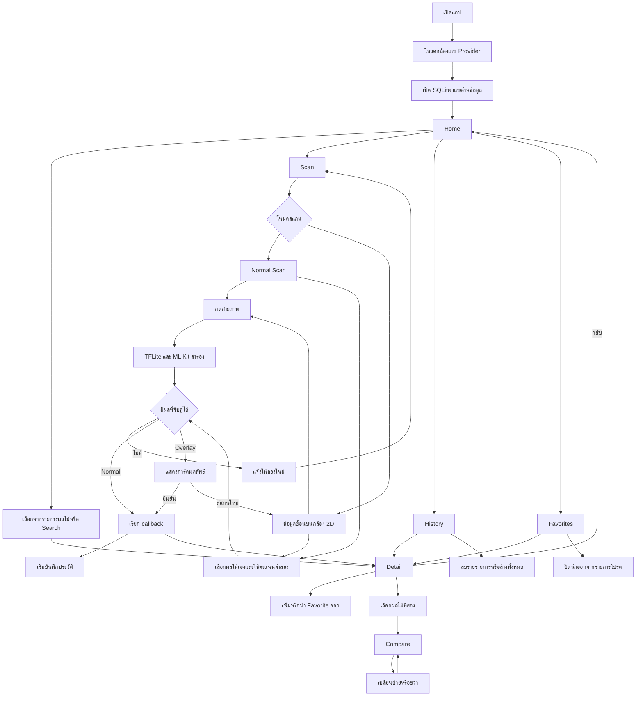

# ลำดับการทำงานของแอป Flutter

> ตรวจจากไฟล์ Flutter ปัจจุบัน วันที่ 8 ตุลาคม 2569 ขอบเขตคือ root ของ app_ar_v1 และโค้ดใน lib ไม่รวมโปรเจกต์ Unity ตามคำยืนยันของผู้ใช้ ไม่แก้ไข source หรือ configuration สถานะจากการอ่านโค้ดไม่เท่ากับผลทดสอบบนอุปกรณ์

## ตั้งแต่เปิดแอป
1. main เรียก WidgetsFlutterBinding.ensureInitialized เพื่อเตรียม Flutter ก่อนใช้ plugin แล้วโหลด availableCameras ถ้าผิดพลาดเก็บรายการกล้องว่าง หลักฐาน [lib/main.dart](C:/Users/jtaku/AndroidStudioProjects/app_ar_v1/lib/main.dart)
2. MultiProvider สร้าง FruitProvider และเริ่ม loadInitialData เปิด SQLite และอ่านผลไม้กับประวัติ ถ้าเกิดข้อผิดพลาดจับ exception และจบสถานะโหลด หลักฐาน [lib/providers/fruit_provider.dart](C:/Users/jtaku/AndroidStudioProjects/app_ar_v1/lib/providers/fruit_provider.dart)
3. DatabaseHelper เปิด fruit_nutrition_v4.db หากสร้างใหม่ สร้าง fruits และ scan_history แล้วใส่ 9 รายการ หาก upgrade เข้าสาขาลบตารางเดิมและสร้างใหม่ หลักฐาน [lib/core/database_helper.dart](C:/Users/jtaku/AndroidStudioProjects/app_ar_v1/lib/core/database_helper.dart)
4. MaterialApp เปิด AppShell ซึ่งเก็บ _tab=0 และ _arMode=false หน้าแรกจึงเป็น Home หลักฐาน [lib/main.dart](C:/Users/jtaku/AndroidStudioProjects/app_ar_v1/lib/main.dart) และ [lib/screens/home_screen.dart](C:/Users/jtaku/AndroidStudioProjects/app_ar_v1/lib/screens/home_screen.dart)

## เส้นทางเลือกเองและดูรายละเอียด
Home/Explore, การ์ดแนะนำ, Search หรือ History เรียก onOpenFruit ไป _openDetail แล้ว Navigator.push DetailScreen การเลือกจากรายการเหล่านี้ไม่ได้เพิ่มประวัติ ส่วน Favorites ใช้ Navigator ของตัวเอง Detail อ่าน Fruit ใหม่ตาม id จาก provider เมื่อรายการโปรดเปลี่ยน

Detail กดหัวใจเรียก toggleFavorite หรือกดเปรียบเทียบเพื่อเปิด FruitSelectionSheet เมื่อเลือกชนิดที่สอง ปิด bottom sheet แล้วเปิด CompareScreen สามารถเปลี่ยนซ้ายหรือขวาด้วย sheet เดิม กลับด้วย Navigator.pop ไม่เพิ่มประวัติจาก Compare

หลักฐาน [lib/screens/detail_screen.dart](C:/Users/jtaku/AndroidStudioProjects/app_ar_v1/lib/screens/detail_screen.dart), [lib/screens/favorites_screen.dart](C:/Users/jtaku/AndroidStudioProjects/app_ar_v1/lib/screens/favorites_screen.dart), [lib/screens/search_screen.dart](C:/Users/jtaku/AndroidStudioProjects/app_ar_v1/lib/screens/search_screen.dart) และ [lib/widgets/fruit_selection_sheet.dart](C:/Users/jtaku/AndroidStudioProjects/app_ar_v1/lib/widgets/fruit_selection_sheet.dart)

## เส้นทาง Normal Scan
1. เปลี่ยน _tab เป็น 1 แสดง ScanScreen ตาม _arMode และซ่อน Bottom Navigation
2. initState เริ่มกล้องแรกในรายการ ใช้ medium ปิดเสียง และ initialize DetectionHelper
3. แตะปุ่มถ่าย ถ้ากล้องไม่พร้อม กำลังถ่าย หรืออยู่ระหว่างผลสำเร็จ ฟังก์ชันจะไม่เริ่มซ้ำ
4. takePicture ได้ path ส่งให้ classifyImagePath ซึ่ง crop กลางภาพและใช้โมเดลหลัก/สำรอง
5. หน้าสแกนจับคู่ label กับ kind/ชื่อ หากไม่เจออาจเลือกตาม index หากไม่พบผลแจ้งลองใหม่
6. สำเร็จแล้ว _selectFruit ตั้ง state รอ 500 ms เรียก onDetected จาก AppShell
7. callback เริ่ม addScanHistory และเปิด Detail โดยไม่ได้ await การเพิ่มประวัติ จึงไม่ควรยืนยันว่าบันทึกสำเร็จก่อนเปิดหน้ารายละเอียดเสมอ
8. เมื่อกลับมายังหน้าสแกน state ตั้งใจรีเซ็ตเพื่อถ่ายใหม่ เมื่อเปลี่ยนแท็บ dispose คืนกล้องและ helper

หลักฐาน [lib/screens/scan_screen.dart](C:/Users/jtaku/AndroidStudioProjects/app_ar_v1/lib/screens/scan_screen.dart), [lib/core/detection_helper.dart](C:/Users/jtaku/AndroidStudioProjects/app_ar_v1/lib/core/detection_helper.dart) และ [lib/main.dart](C:/Users/jtaku/AndroidStudioProjects/app_ar_v1/lib/main.dart)

## เส้นทางข้อมูลซ้อนบนกล้อง
สลับ _arMode=true เพื่อใช้ ArScanScreen ภายในถ่ายภาพและจับคู่เหมือน Normal Scan แต่ _showArResult แสดงการ์ดก่อน ยังไม่บันทึก history เมื่อกดยืนยัน _confirmAndNavigate เรียก onDetected แล้ว _resetScan ส่วนการกดสแกนใหม่ก่อนยืนยันไม่เรียก callback

กล้องด้านหลังยังเป็นภาพสด แต่ผลจำแนกอ้างอิงภาพที่ถ่าย การ์ดจึงไม่ได้ติดตามผลไม้สดในโลกจริง หลักฐาน [lib/screens/ar_scan_screen.dart](C:/Users/jtaku/AndroidStudioProjects/app_ar_v1/lib/screens/ar_scan_screen.dart)

## ประวัติและรายการโปรด
ประวัติอ่าน JOIN ผลไม้ ลบรายรายการด้วยกดค้างและยืนยัน ล้างทั้งหมดโดยปุ่มบนหน้า History ส่วน favorites เปลี่ยน isFavorite ใน SQLite แล้วอัปเดตชุดผลไม้และ history ในหน่วยความจำ ไม่มีบัญชีหรือ cloud synchronization

## Flowchart ของผู้ใช้

ลูกศรกลับไป Home สรุปการกลับเข้าสู่ AppShell ในภาพรวม หน้าจอจริงย้อนกลับไปยังแท็บที่เปิด Detail ไม่บังคับทุกเส้นทางกลับแท็บ Home

## เส้นทางผิดพลาดที่ยังต้องทดสอบ
ไม่มี camera, ปฏิเสธ permission, โหลดโมเดลไม่ได้, ไม่พบ label และฐานข้อมูลผิดพลาด การแสดงข้อความสถานะใน state ไม่ยืนยันว่า error นั้นมองเห็นได้จริง เพราะหน้าสแกนบางกรณียังเลือกแสดงหน้ากำลังโหลด
