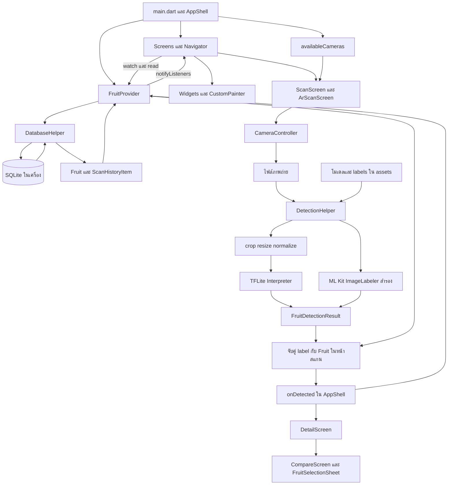

# สถาปัตยกรรม Flutter และการรับส่งข้อมูล

> ตรวจจากไฟล์ Flutter ปัจจุบัน วันที่ 8 ตุลาคม 2569 ขอบเขตคือ root ของ app_ar_v1 และโค้ดใน lib ไม่รวมโปรเจกต์ Unity ตามคำยืนยันของผู้ใช้ ไม่แก้ไข source หรือ configuration สถานะจากการอ่านโค้ดไม่เท่ากับผลทดสอบบนอุปกรณ์

## โครงสร้างที่พบจริง
เป็นการแยกโค้ดตามหน้าที่ใน lib: models เก็บโครงสร้างข้อมูล, screens แสดงหน้าจอ, widgets เก็บส่วนที่ใช้ซ้ำ, providers เก็บสถานะร่วม และ core เก็บ theme, ฐานข้อมูล และตัวช่วยจำแนก อธิบายได้ว่าเป็นระบบแบ่งชั้นตามหน้าที่ ไม่พบกฎหรือ interface ที่ยืนยันว่าใช้ Clean Architecture เต็มรูปแบบ

ไม่มี Unity Scene, GameObject หรือ Prefab ใน runtime ของ Flutter รายงานนี้ไม่วิเคราะห์ Unity ในโฟลเดอร์อื่น ส่วนชื่อ AR Mode เป็น camera overlay แบบ 2D

## แผนภาพสถาปัตยกรรม

## UI และสถานะ
[lib/main.dart](C:/Users/jtaku/AndroidStudioProjects/app_ar_v1/lib/main.dart) สร้าง ChangeNotifierProvider และ AppShell ใช้ _tab กับ _arMode เป็น state เฉพาะหน้าหลัก ส่วนผลไม้ ประวัติ และรายการโปรดอยู่ใน [lib/providers/fruit_provider.dart](C:/Users/jtaku/AndroidStudioProjects/app_ar_v1/lib/providers/fruit_provider.dart) หน้าจอใช้ context.watch เมื่อต้องสร้าง UI ใหม่ และ context.read เมื่อต้องเรียกคำสั่ง

ChangeNotifier คือวัตถุที่แจ้งผู้ฟังเมื่อข้อมูลเปลี่ยน notifyListeners ไม่ได้บันทึกฐานข้อมูลเอง คำสั่งของ Provider ต้องเรียก DatabaseHelper ก่อน

## สัญญาของข้อมูล
- Fruit มี id, name, scientificName, kind, kcal, fiber, sugar, carbs, protein, fat, vitaminC, score, servingSize และ isFavorite ค่า score อ่านจากคอลัมน์ healthScore
- Fruit.copyWith เปลี่ยนได้เฉพาะ isFavorite โดยคงฟิลด์อื่น
- ScanHistoryItem เก็บ historyId, Fruit และ scanTime อ่านจากผล JOIN
- FruitDetectionResult เก็บ label, index, confidence และ source ข้อมูลนี้ไม่ถูกเก็บครบใน scan_history

หลักฐาน [lib/models/fruit.dart](C:/Users/jtaku/AndroidStudioProjects/app_ar_v1/lib/models/fruit.dart), [lib/models/scan_history.dart](C:/Users/jtaku/AndroidStudioProjects/app_ar_v1/lib/models/scan_history.dart) และ [lib/core/detection_helper.dart](C:/Users/jtaku/AndroidStudioProjects/app_ar_v1/lib/core/detection_helper.dart)

## คำสั่งและเหตุการณ์สำคัญ

| เหตุการณ์ | คำสั่งและผล |
|---|---|
| เริ่มแอป | loadInitialData อ่าน fruits แล้ว loadHistory |
| ผลสแกนหรือผลเลือกจำลอง | onDetected เริ่ม addScanHistory และ Navigator เปิด Detail |
| กดหัวใจ | toggleFavorite อัปเดตฐานข้อมูล แทน Fruit ด้วย copyWith และอัปเดตผลไม้ใน history |
| กดค้างประวัติและยืนยัน | removeHistoryItem ลบจาก SQLite และรายการในหน่วยความจำ |
| ล้างประวัติ | clearAllHistory ลบทั้งตารางและล้างรายการ |
| เลือกคู่เปรียบเทียบ | FruitSelectionSheet เรียก onSelected และ CompareScreen setState |

## ฐานข้อมูลและความสัมพันธ์
[lib/core/database_helper.dart](C:/Users/jtaku/AndroidStudioProjects/app_ar_v1/lib/core/database_helper.dart) เปิด fruit_nutrition_v4.db version 4 ใต้ getDatabasesPath ตาราง fruits ใช้ id เป็น primary key และ scan_history อ้าง fruitId มี SQL FOREIGN KEY ON DELETE CASCADE ใน schema แต่ไม่พบการเปิด PRAGMA foreign_keys ใน onConfigure จึงไม่ยืนยันว่า constraint บังคับใช้จริง

readAllFruits ไม่มี ORDER BY ส่วน readHistory ใช้ JOIN และ ORDER BY h.scanTime DESC ข้อมูลเวลาเป็น dd/MM/yyyy HH:mm จึงเสี่ยงเรียงผิดข้ามเดือน/ปี การอัปเกรด schema ลบตารางเดิมและ seed ใหม่ ไม่ใช่ migration ที่รักษารายการผู้ใช้

คำสั่งลบ/อัปเดตใช้ whereArgs สำหรับ id ฐานข้อมูลไม่มี backend service หรือ REST API ใน source ปัจจุบัน ไม่พบ HTTP client ที่ใช้เรียกข้อมูลโภชนาการของแอป

## กล้องและวงจรชีวิต
หน้าสแกนสร้าง controller ของกล้องแรก resolution medium ปิดเสียง ถ่ายภาพตามปุ่ม และ dispose เมื่อปิดหน้า DetectionHelper เป็น singleton จึงใช้ instance เดียวกันทั้งสองหน้าสแกน การสลับโหมดขณะกำลัง initialize/dispose เป็นสถานการณ์ที่ควรทดสอบ ไม่มีหลักฐานยืนยัน race จาก runtime ในการตรวจนี้

## ขอบเขต ML
ข้อมูลเข้าในโค้ดเป็น RGB [1,224,224,3] และ normalize ด้วย (value−127.5)/127.5 ค่าผลไม้ทางโภชนาการมาจาก SQLite ภายหลังจับคู่ชนิด ไม่ได้จากโมเดลโดยตรง ไม่พบขั้นตอนฝึกโมเดลในโปรเจกต์ และยังไม่ได้เปิด Interpreter เพื่อตรวจ tensor metadata จริง

## ส่วนที่ยังไม่มี
ไม่พบ authentication, remote database, API ของแอป, QR scanner, ARCore session, anchors หรือ world tracking ใน Flutter การมี native runner ของ iOS/Web/Desktop ไม่ยืนยันว่าความสามารถที่พึ่ง plugin ใช้งานได้บนแพลตฟอร์มเหล่านั้น
